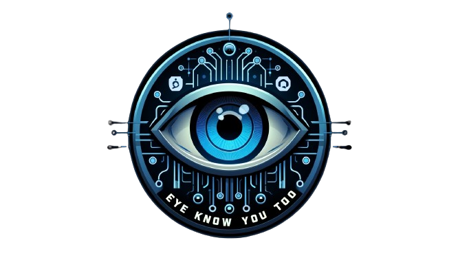

## Eye Know You Too

<div align="center">
    
</div>

### Table of Contents
- [Introduction](#introduction)
- [Comparison with the official repository](#comparison-with-the-official-repository)
  - [Task Group](#task-group)
  - [Test-retest Interval](#test-retest-interval)
  - [Duration](#duration)
  - [Sampling Rate](#sampling-rate)
- [Dataset](#dataset)

### Introduction
This repository is an unofficial PyTorch implementation of the paper "Eye Know You Too: Toward Viable End-to-End Eye Movement Biometrics for User Authentication." The official implementation is available [here](https://dataverse.tdl.org/dataset.xhtml?persistentId=doi:10.18738/T8/61ZGZN).

While the official implementation utilizes PyTorch Lightning, this repository offers a simpler alternative using standard PyTorch, which is more widely recognized and commonly used among researchers. This adaptation makes it easier for those familiar with PyTorch to understand and modify the code without needing to learn an additional framework.

## Comparison with the official repository
To ensure a fair evaluation of both implementations, we have retrained EKYT models using both the official and this repository. We then assessed their performance in terms of Equal Error Rate (EER %), with the results presented in the tables below. The difference in EER (%) is minimal, indicating a correct implementation in this repository. For some tasks, the original implementation performs slightly better; for others, the EER is the same across both approaches, and in some cases, our model slightly outperforms the original. These variations are mainly due to the stochastic nature of deep learning and are entirely random.

#### Task Group
| Task | Official Implementation (EER %) | Our Implementation (EER %) | 
| -- | -- | -- |
| TEX | 3.95 | 4.39 | 
| HSS |  5.08  | 5.87  |
| RAN |  5.08 | 5.08 |
| FXS | 11.25  | 11.86  |
| VD1 | 7.27  | 6.41 | 
| VD2 | 4.96  | 5.08 |
| BLG | 7.97  | 6.25 |
 
#### Test-retest Interval
| Round | Official Implementation (EER %) | Our Implementation (EER %) | 
| -- | -- | -- |
| R2 | 9.21 | 6.89 |
| R3 | 6.89 | 8.26  |
| R4 | 9.21 | 8.62  |
| R5 | 9.73 | 6.89  |
| R6 | 6.89 | 6.15  |
| R7 | 8.82 | 8.82  |
| R8 | 10.00 | 8.18  |
| R9 | 7.69  | 7.69  |

#### Duration
| Duration (s) | Official Implementation (EER %) | Our Implementation (EER %) | 
| -- | -- | -- |
| 5 x 2 | 1.72 | 3.44  | 
| 5 x 3 | 1.69 | 1.69  | 
| 5 x 4 | 1.11 | 0.40  | 
| 5 x 5 | 1.02 | 0.49   | 
| 5 x 6 | 0.81 | 0.49   | 
| 5 x 7 | 0.61 | 0.61  | 
| 5 x 8 | 0.49 | 0.61   | 
| 5 x 9 | 0.49 | 0.61  | 
| 5 x 10 | 0.37 | 0.61   | 
| 5 x 11 | 0.55 | 0.54  | 
| 5 x 12 | 0.46 | 0.75  | 

#### Sampling Rate
| Sampling Rate (Hz) | Official Implementation (EER %) | Our Implementation (EER %) | 
| -- | -- | -- |
| 500 Hz | TBU | 5.66  |
| 250 Hz | TBU | 5.19  |
| 125 Hz | TBU | 8.74 |
| 50 Hz | TBU | 13.79  |
| 31.25 Hz | TBU | 22.41 |

### Dataset
We utilize the GazeBase dataset, the same one used in the original implementation. This dataset contains eye-tracking data recorded at 1000 Hz while participants engaged in various tasks such as watching videos, reading, etc. Upon initiating the training of the model, the script automatically downloads the dataset and processes it into .pkl files. The processing technique adheres to the descriptions in the referenced paper and the original implementation. It includes converting raw gaze coordinates into smoothed first derivative points using a Savitzky-Golay filter, followed by downsampling the recordings to the desired frequency. 

If you wish to bypass the processing step to save time, you can download the pre-processed .pkl files from the link below:

| Name | Link | 
| -- | -- | 
| GazeBase - 1000 HZ | [LINK](https://www.dropbox.com/scl/fi/q7rn48pudd7cyp9t8950v/gazebase_savgol_ds1_normal.pkl?rlkey=o7o57856y6ozz7lh2ernwikoz&st=1nbowchk&dl=0) | 
| GazeBase - 500 HZ | [LINK](https://www.dropbox.com/scl/fi/y2c10di7313c5lb5kvhpu/gazebase_savgol_ds2_normal.pkl?rlkey=d5yoxma548kfm5iyxv5zoxc4o&st=eerp8r59&dl=0) | 
| GazeBase - 250 HZ | [LINK](https://www.dropbox.com/scl/fi/2cku2vdf3qhrnigclp0z8/gazebase_savgol_ds4_normal.pkl?rlkey=71nt2ybh4rpemmwrwsxcseysf&st=xk7ct4fm&dl=0) | 
| GazeBase - 125 HZ | [LINK](https://www.dropbox.com/scl/fi/3axxu21idvhpvtajeiwai/gazebase_savgol_ds8_normal.pkl?rlkey=r8mwa7qf1exht911gba7obyfg&st=41u9ffey&dl=0) |
| GazeBase - 50 HZ | [LINK](https://www.dropbox.com/scl/fi/iy8iqxwtlqrqqs3x0y4ih/gazebase_savgol_ds20_normal.pkl?rlkey=cbm72r8hdbwulm0z9meqcgdcn&st=sl4eyd2i&dl=0) | 
| GazeBase - 31.25 HZ | [LINK](https://www.dropbox.com/scl/fi/hvz770g58g50cl7dzwnue/gazebase_savgol_ds32_normal.pkl?rlkey=3a0ggn3sb6jcwwaowxgivmljb&st=hhcm754e&dl=0) |

Then make sure to place them within `data/processed/` directory. The directory tree must look like shown below: 

```
data/
├── processed
│   ├── gazebase_savgol_ds1_normal.pkl
│   ├── gazebase_savgol_ds2_normal.pkl
│   ├── gazebase_savgol_ds4_normal.pkl
│   ├── gazebase_savgol_ds8_normal.pkl
│   ├── gazebase_savgol_ds20_normal.pkl
│   └── gazebase_savgol_ds32_normal.pkl
```


